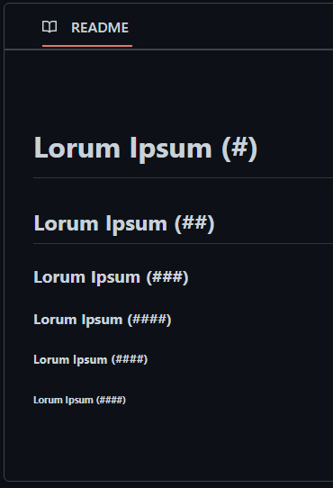
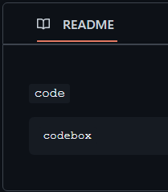
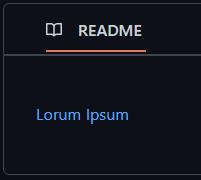
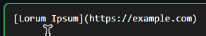
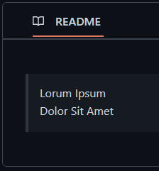
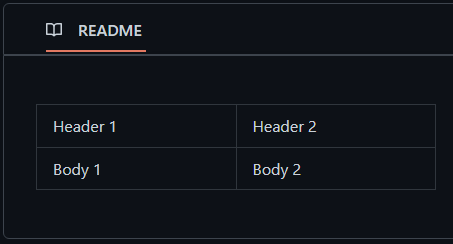
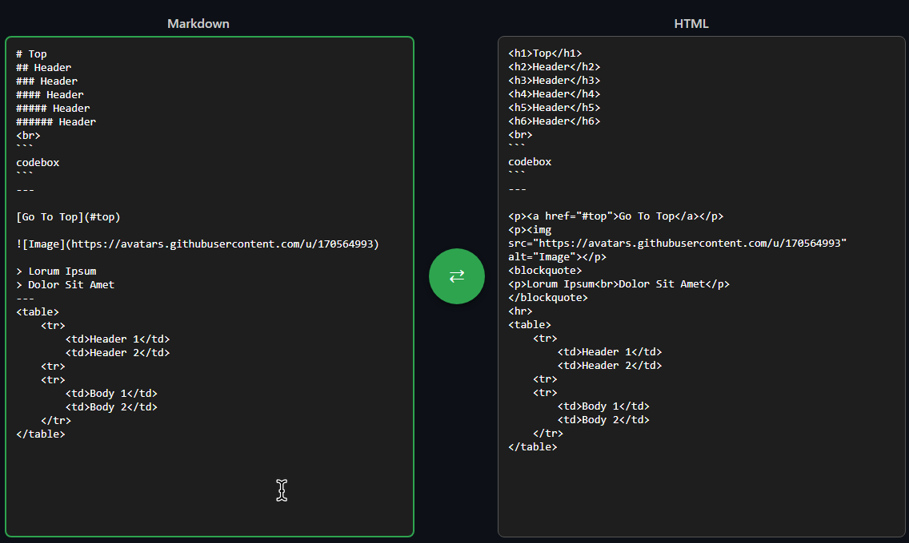

# HTMLMarkdown
### This project puts github readme into the browser!

It is quite self-explanatory, you first get your markdown file.
Then go to [the translator page](https://JensTech.github.io/HTMLMarkdown/translator),
Paste your markdown code in there and it will output the code you need, you can also flip this and reverse it


<details>
<summary>What works</summary>

## What works:
### Headers up to 6


---

### Code:


---

### Links
#### Full markdown links (must be translated)




---

### Indentation


---

### Tables
### Workaround:
Translate everything else, then manually add the
```
<table>
    <tr>
        <td>Header 1</td>
        <td>Header 2</td>
    <tr>
    <tr>
        <td>Body 1</td>
        <td>Body 2</td>
    </tr>
</table>
```
later. Here's an example:



</details>

<details>
<summary>Partially works</summary>

## What partially works:
### Skipping to headers
#### This partially works, when translating, in markdown (before translation) do:
```
[Lorum Ipsum](#Header1)
```
then when you have pasted the markdown into your website, change the header to
```
<h1 id="Header1">Header</h1>
```
and you should skip down the page
</details>


## The translator
### Translates HTML to markdown and back. Very simple
